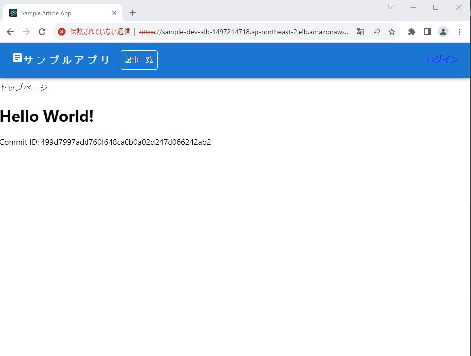
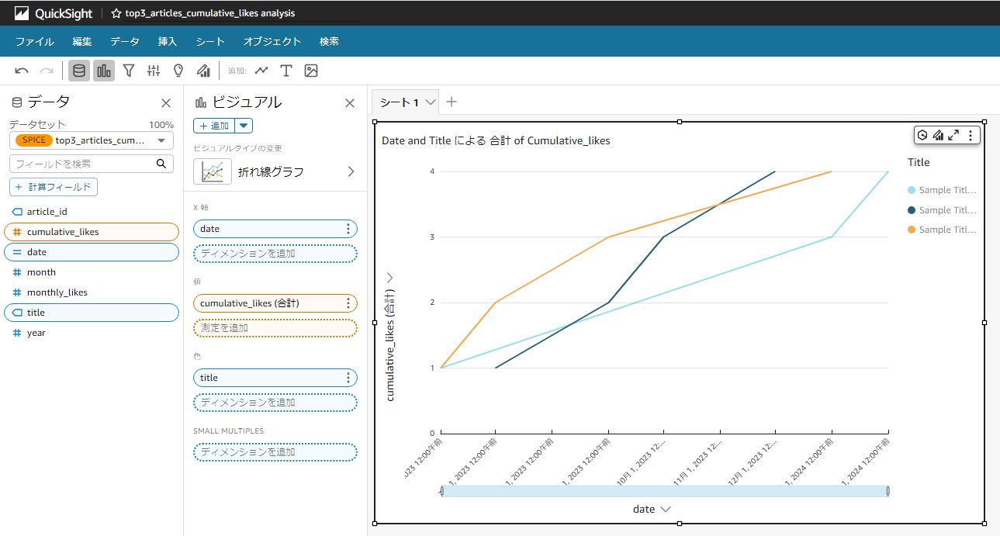

ECSを主体としたサンプルアプリケーションをAWS CDKで構築。

## 構成図


* ECS/Fargateでアプリケーションを構成し、パブリックサブネット上のALBをその全面に配置。
* ALBにACM証明書をアタッチしHTTPS通信可能。（デフォルトでは自己署名証明書を使用）
* ECS/FargateアプリからDB（AuroraServerlessV2）への接続情報をSecretsManagerに保管。
* DB接続情報のパスワードは自動生成し一定期間でローテーションする。
* パブリックサブネット上のCloud9からDBにアクセスし保守等を行う。
* ユーザ認証をCognitoで管理。
* GitHubリポジトリの変更をトリガーにCI/CDが動き、APPスタック（ECSやECR）をデプロイする。
* EventBridgeのスケジュール実行でStepFunctionsが起動し、Glue ETL処理を実行する。
* ETL処理で変換されたデータがParquet形式でS3に格納される。
* Athena、QuickSightでデータ分析、可視化を行うことができる。


## ディレクトリ構成

ディレクトリ構成を以下に示す。

    .
    ├── bin                     # CDKのエントリポイント
    ├── docs                    # 画像などを格納
    ├── lib                     # CDKのスタックやConstructを格納
    ├── src
    │   ├── backend             # バックエンド用のソースコード
    │   ├── frontend            # フロントエンド用のソースコード
    │   ├── glue                # Glueスクリプト用のソースコード
    │   ├── mysql               # DB用の各種ファイル（主にローカル開発環境用）
    │   ├── .env
    │   └── docker-compose.yml
    ├── test
    ├── README.md
    ├── buildspec.yml
    ├── cdk.context.json
    ├── cdk.json
    ├── jest.config.js
    ├── package-lock.json
    ├── package.json
    └── tsconfig.json

## デプロイ方法

1. CodeStar接続の作成  
    既にアカウント内に対象のGitリポジトリへの接続が作成されている場合、本手順は不要。
    1. CodePipelineサービス画面左ペインから`設定 > 接続`を押下。
    2. `接続を作成`ボタン押下。
    3. `プロバイダーを選択する`で`GitHub`、接続名に任意の名前を入力し`GitHubに接続する`ボタン押下。  
        例：`{システム識別子}-{環境識別子}-conn-cms1-ipd`
    4. GitHubアプリに接続先のGitHubを設定し、`接続`ボタン押下。
    5. 接続作成後のARNを控える。

1. ACM自己署名証明書の準備  
    自己署名証明書ではなく正式にACMの証明書を準備している場合、本手順は不要。  
    1. 以下コマンドを実行しSSL証明書を作成する。  
        ```sh
        # 作業用フォルダへ移動
        cd {任意の空のフォルダ}
        # 秘密鍵の作成
        openssl genrsa -out private.key
        # CSRファイルの作成
        # 対話モードでCSRファイルの各種属性を設定する
        # その際「Common Name」の設定値は「sampleapp.local」などを入力すること
        # その他属性はデフォルトのままでOK
        openssl req -new -key private.key -out server.csr
        # SSL証明書の作成
        # 有効期限は1年(365日)
        openssl x509 -req -days 365 -in server.csr -signkey private.key -out server.crt
        ```
    1. ACMサービス画面に移動し左サイドペインから`証明書をインポート`を押下。
    1. 証明書本文に`server.crt`の内容を、証明書のプライベートキーに`private.key`の内容を貼り付ける。
    1. インポート完了後、証明書ARNを控える。

1. `cdk.json`の編集  
    `context`ステートメント内の以下値をプロジェクトに応じて変更する。
  
    | キー | 説明 | 例 |
    | ---- | ---- | ---- |
    | sysId | システム識別子。リソース名に付与される。 | sample |
    | envId | 環境識別子。リソース名に付与される。次の値のいずれかのみ入力すること。{dev, stg, prd} | dev |
    | projectName | プロジェクト名。各リソースに付与されるProjectNameタグの値。 | - |
    | env.account | AWSアカウントID | - |
    | env.region | AWSリージョン | - |
    | github.owner | 連携対象のGitHubオーナー名。 | - |
    | github.repo | 連携対象のGitHubリポジトリ名。 | - |
    | github.connectionArn | GitHubと接続するCodeStar接続ARN。手順1. で作成した接続ARNを入力する。 | - |
    | github.branch | 環境識別子に対応するGitHubブランチ名 | - |
    | domain | プロジェクトのドメイン名。空文字の場合ALBのDNS名がアクセスポイントになる。 | - |
    | certificateArn | ACM証明書のARN。手順2. で作成した証明書のARNを入力する。（本サンプルでは自己署名証明書を使用。） | - |
    | cloud9Owner | 管理用Cloud9の所有者IAMユーザ名。切り替え後のロールでアクセスする場合は「<切り替え先ロール名>/<切り替え元ユーザ名>」と入力する。 | IAMユーザで使用する場合、IAMユーザ名, ロール切り替えの場合、 IAMロール名/IAMユーザ名 |
    | networkConf.cidrBlock | VPCネットワークのCIDRブロック。 | 10.0.0.0/16 |
    | networkConf.cidrMaskPub | パブリックサブネットのサブネットマスク。 | 24 |
    | networkConf.cidrMaskPri | プライベートサブネットのサブネットマスク。 | 24 |
    | networkConf.cidrMaskSec | プライベートサブネット（DB）のサブネットマスク。 | 28 |
    | dataConf.userName | DBユーザー名。 | admin |
    | dataConf.dbName | Database名。 | mydb |
    | dataConf.minCapacity | AuroraServerlessV2の最小ACU。 | 0.5 |
    | dataConf.maxCapacity | AuroraServerlessV2の最大ACU。 | 1 |
    | dataConf.glueCodePath | Glue ETL Jobが実行するスクリプト。 | src/glue/etl.py |
    | dataConf.email | StepFunctions失敗通知先のEMailアドレス。 | - |
    | dataConf.etlCron | ETL処理のスケージュール実行用cron定義。 | cron(0 3 * * ? *) |

1. CDKのバージョン更新を確認する。
    ```sh
    npx -p npm-check-updates  -c "ncu"
    ```
1. CDKのバージョンを更新する。（※開発フェーズでのみ行う）
    ```sh
    npx -p npm-check-updates  -c "ncu -u"
    ```
1. パッケージをインストールする。
    ```sh
    npm install
    ```

1. Baseスタックをデプロイする。
    ```sh
    cdk deploy BaseStack
    ```

1. 初期DBスキーマ情報登録
    1. SecretsManagerサービス画面より`{システム識別子}-{環境識別子}-secret-aurora`を選択する。
    1. `シークレットの値を取得する`ボタンを押下しシークレットの内容を控える。
    1. Cloud9サービス画面より`{システム識別子}-{環境識別子}-env`を選択し開く。
    1. 以下コマンドを実行しDBスキーマ情報を登録する。  
        ```sh
        # mysqlでDBに接続
        mysql -u admin -p -h {上記で控えたhostの値}
        Enter password: {上記で控えたpasswordの値}
        # src/mysql/init/init.sql ファイルの内容をコピーし実行する。
        USE mydb;
        CREATE TABLE IF NOT EXISTS article (
          id CHAR(36) NOT NULL,
          title VARCHAR(20) NOT NULL,
          contents TEXT NOT NULL,
          is_published boolean NOT NULL,
          created_by VARCHAR(40) NOT NULL,
          created_at datetime NOT NULL,
          updated_by VARCHAR(40) NOT NULL,
          updated_at datetime NOT NULL,
          PRIMARY KEY (id)
        );
        CREATE TABLE IF NOT EXISTS favorite (
          article_id CHAR(36) NOT NULL,
          user_id VARCHAR(40) NOT NULL,
          fav_at datetime NOT NULL,
          PRIMARY KEY (article_id, user_id),
          FOREIGN KEY (article_id) REFERENCES article(id)
        );
        # テーブル定義を確認し正常にテーブル定義が作成されていることを確認する。（出力結果略）
        SHOW TABLES;
        DESCRIBE article;
        DESCRIBE favorite;
        # 切断する。
        exit
        ```
    1. Cloud9環境のウィンドウを閉じる。  

1. CI/CDスタックをデプロイする。
    ```sh
    cdk deploy CicdStack
    ```

CI/CDスタックが正常にデプロイされると、CI/CDスタックからAPPスタックがデプロイされる。
以降GitHubブランチを更新するごとにCI/CDが実行されAPPスタックがデプロイされる。

## 動作確認

1. 以下コマンドを実行しALBのDNS名を取得する。
    ```sh
    # 利用するリージョンを指定
    # 例：export AWS_DEFAULT_REGION=ap-northeast-1
    export AWS_DEFAULT_REGION={リージョン名}
    # ALB名を指定
    # 例：export LoadBalancerName=sample-dev-alb
    export LoadBalancerName={システム識別子}-{環境識別子}-alb
    # ALBのDNS名を取得
    aws elbv2 describe-load-balancers --query LoadBalancers[?LoadBalancerName==\'${LoadBalancerName}\'].DNSName --output text
    # 出力例：sample-dev-alb-1497214718.ap-northeast-2.elb.amazonaws.com
    ```
2. 上記コマンドで出力されたDNS名にブラウザでアクセスする。
3. 自己証明書の場合プライバシーエラーが表示されるので、`詳細設定` > `...にアクセスする（安全ではありません）`リンクを押下。
4. 以下のような画面が表示されることを確認する。  
    

### ETL実行手順

ETL処理を行うStepFunctionsを呼び出すEventBridgeルールの実行時間を設定する。
（※本手順を行わなくてもcronで設定した時刻まで待つことでETL処理を行うことも可能）

1. EventBridgeサービス画面の左サイドペインから`ルール`を押下。
2. 以下ルール名を選択。  
    ルール名：`{システム識別子}-{環境識別子}-rule-etl`
3. `イベントスケジュール`タブから`編集`ボタンを押下。
4. cronを現在時刻+1~2分程度に設定し保存。
5. StepFunctionsサービス画面の左サイドペインから`ステートマシン`を押下。
6. 以下リソース名を選択。
    リソース名：`{システム識別子}-{環境識別子}-sfn-etl`
7. `実行`タブより最新の実行リンクを押下。
8. しばらく待ち実行ステータスが`成功`になることを確認。

### Athena

サンプルデータからトップ3記事の月ごとのいいね数推移を集計したビュー表を作成する例。

1. Athenaサービス画面の左サイドペインから`クエリエディタ`を押下。
2. `設定`タブよりクエリの結果の場所を設定。  
    設定値：`s3://{システム識別子}-{環境識別子}-s3-etl-processed-{アカウントID}/result/`
3. `エディタ`タブより以下を設定。  
    * データソース：AwsDataCatalog
    * データベース：{システム識別子}-{環境識別子}-glue-db-processed
4. クエリフィールドにクエリを記述し`実行`ボタン押下。  
    クエリ例：月ごとの売上高を集計したビュー表を作成
    ```sql
    -- トップ3記事のIDを取得するサブクエリを使用して月ごとの累計いいね数を表示するビューを作成
    CREATE VIEW top3_articles_cumulative_likes AS
    SELECT
      a.id AS article_id,
      a.title,
      YEAR(f.fav_at) AS year,
      MONTH(f.fav_at) AS month,
      COUNT(f.article_id) AS monthly_likes,
      SUM(COUNT(f.article_id)) OVER (PARTITION BY a.id ORDER BY YEAR(f.fav_at), MONTH(f.fav_at)) AS cumulative_likes
    FROM
      mydb_article a
    JOIN
      mydb_favorite f ON a.id = f.article_id
    WHERE
      a.id IN (
        SELECT article_id
        FROM (
          SELECT
            f.article_id,
            COUNT(f.article_id) AS like_count
          FROM
            mydb_favorite f
          GROUP BY
            f.article_id
          ORDER BY
            like_count DESC
          LIMIT 3
        ) top_articles
      )
    GROUP BY
      a.id, a.title, YEAR(f.fav_at), MONTH(f.fav_at)
    ORDER BY
      a.id, YEAR(f.fav_at), MONTH(f.fav_at);
    ```

### QuickSight

Athenaでクエリしたビュー表を棒グラフ化する例。

* 前提：
    * QuickSightアカウントが存在すること。
    * 言語は日本語での手順を記載。

1. QuickSightサービス画面の右上ユーザメニューから`QuickSightを管理`を押下。
2. 左サイドメニューより`セキュリティとアクセス許可`を選択。
3. `QuickSight の AWS のサービスへのアクセス`でS3およびAthenaを有効化。
4. QuickSightサービス画面の左サイドメニューより`分析`を選択。
5. `新しい分析`ボタンを押下。
6. `新しいデータセット`ボタンを押下。
7. `Athena`を選択。
8. 任意のデータソース名を入力し`データソースを作成`ボタン押下。
9. 以下を設定し`選択`ボタン押下。  
    * データソース：AwsDataCatalog
    * データベース：{システム識別子}-{環境識別子}-glue-db-processed
    * テーブル：Athenaで作成したビュー表
10. `迅速な分析のために SPICE へインポート`を選択し`Visualize`ボタン押下
11. ビジュアルエディタでデータ可視化する。  
    例：折れ線グラフを選択し、X軸にdata（※）、値にcumulative_likes、色にtitleを設定。  
    ※計算フィールドで次を定義：parseDate(concat(toString(year), '-', toString(month), '-01'), 'yyyy-MM-dd')  
    

## クリーン手順

開発環境（dev）ではDBも削除されるため、必要に応じてバックアップすること。

1. 以下コマンドを順に実行。
```sh
cdk destroy AppStack
cdk destroy CicdStack
cdk destroy BaseStack
```

## 使用技術
### フロントエンド
React.js, 
TypeScript, 
aws-amplify（ログイン認証に使用）, 
Material UI

### バックエンド
Express.js, 
TypeScript

### インフラ
AWS, 
MySQL, 
Docker
